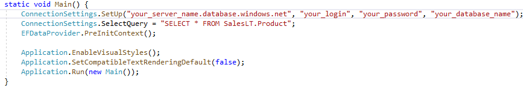

# How to bind Data Grid to Azure SQL data

This example illustrates how to fetch data from the [Azure SQL data base](https://azure.microsoft.com/en-us/services/sql-database/) and show it in the [GridControl](https://docs.devexpress.com/WindowsForms/DevExpress.XtraGrid.GridControl).

Note that in order to bind any data set to a data-aware control, this data set must implement either the **IList** or **IListSource** interface. Refer to the [Data Binding](https://docs.devexpress.com/WindowsForms/634/controls-and-libraries/data-grid/data-binding) help article to learn more.

This example contains sample **AdventureWorksLT** data. To generate a sample database identical to the one used in this example, follow the [Quickstart: Create a single database in Azure SQL Database using the Azure portal, PowerShell, and Azure CLI](https://docs.microsoft.com/en-us/azure/sql-database/sql-database-single-database-get-started?tabs=azure-portal) Microsoft article.

Three Ribbon buttons allow you to bind to a sample Azure database using one of the following methods:

* direct binding to a standard **DataTable** object;
* binding with a DevExpress [SqlDataSource](https://docs.devexpress.com/CoreLibraries/DevExpress.DataAccess.Sql.SqlDataSource) component;
* binding with an **Entity Framework** model.

To run this example, you need to:
* [create a server-level firewall rule for your database](https://docs.microsoft.com/en-us/azure/sql-database/sql-database-server-level-firewall-rule);
* specify your connection settings in the **Main** method.
> 
